<div align="center">
  
# 👋 Hi, I'm Mhd. Galih Khairi


<br/>

[](https://www.linkedin.com/in/mhd-galih-khairi-033255181/)
[](mailto:mgalihkhairi1@gmail.com)
[](https://github.com/pack467)

<br/>

```bash
$ whoami
> Full Stack Developer | AI Integrator | Creative Technologist

$ cat ~/location
> 📍 Medan, North Sumatra, Indonesia 🇮🇩

$ echo $PHILOSOPHY
> "Code is poetry. Design is art. Together, they create magic." ✨
```

</div>

---

## 🚀 About Me

```typescript
const galih = {
    role: "Computer Science Graduate",
    location: "Medan, Indonesia 🌏",
    passions: ["Web Development", "AI Integration", "Multimedia Design"],
    currentFocus: "Building intelligent web applications",
    lifePhilosophy: "Code. Create. Improve. Repeat. 🔄",
    funFact: "I transform caffeine into code and ideas into pixels ☕️→💻"
};
```

<table align="center">
  <tr>
    <td align="center" width="50%">
      
### 🔭 Currently Working On
      
**AI-Powered Web Applications**  
Integrating machine learning models with modern web frameworks
      
    </td>
    <td align="center" width="50%">
      
### 🌱 Currently Learning
      
**Advanced ML & Cloud Architecture**  
Deep diving into scalable AI solutions
      
    </td>
  </tr>
  <tr>
    <td align="center" colspan="2">
      
### 💡 What Drives Me
      
Creating **useful**, **beautiful**, and **impactful** digital experiences that make a difference
      
    </td>
  </tr>
</table>

---

## 💻 Tech Arsenal

<div align="center">

### 🎨 Frontend Development


### ⚙️ Backend Development


### 🗄️ Database & Cloud


### 🎨 Design & Multimedia


### 🛠️ Tools & Platforms


</div>

---

## 📊 GitHub Analytics

<div align="center">
  


</div>

---

## 🏆 GitHub Trophies

<div align="center">
  


</div>

---

## 📈 Contribution Activity

<div align="center">


</div>

---

## 🎯 My Approach

```mermaid
graph LR
    A[💡 Idea] --> B[🎨 Design]
    B --> C[💻 Develop]
    C --> D[🧪 Test]
    D --> E[🚀 Deploy]
    E --> F[📊 Analyze]
    F --> G[🔄 Improve]
    G --> C
    
    style A fill:#79C0FF,stroke:#1f6feb,color:#0d1117
    style B fill:#79C0FF,stroke:#1f6feb,color:#0d1117
    style C fill:#79C0FF,stroke:#1f6feb,color:#0d1117
    style D fill:#79C0FF,stroke:#1f6feb,color:#0d1117
    style E fill:#79C0FF,stroke:#1f6feb,color:#0d1117
    style F fill:#79C0FF,stroke:#1f6feb,color:#0d1117
    style G fill:#79C0FF,stroke:#1f6feb,color:#0d1117
```

<div align="center">



</div>

---

## 🌟 Featured Projects

<div align="center">
  
[](https://github.com/pack467/REPO_NAME)
[](https://github.com/pack467/REPO_NAME)

</div>

> 💡 **Note:** Ganti `REPO_NAME` dengan nama repository favorit Anda

---

## 💬 Random Dev Quote

<div align="center">


</div>

---

<div align="center">

### 🎵 Spotify Playing

[](https://open.spotify.com/user/YOUR_SPOTIFY_ID)

> 💡 **Note:** Setup [Novatorem](https://github.com/novatorem/novatorem) untuk menampilkan lagu yang sedang diputar

</div>

---

<div align="center">

## 📫 Let's Connect!

**Open for collaborations, freelance projects, and tech discussions!**

<br/>

<a href="https://www.linkedin.com/in/mhd-galih-khairi-033255181/">
  
</a>
<a href="mailto:mgalihkhairi1@gmail.com">
  
</a>
<a href="https://github.com/pack467">
  
</a>

<br/>
<br/>


<br/>

---

### ⭐️ From [pack467](https://github.com/pack467) with 💙

**If you like my work, consider giving a star to my repositories!**

```bash
git add . && git commit -m "Made someone smile today ✨" && git push origin main
```

</div>
